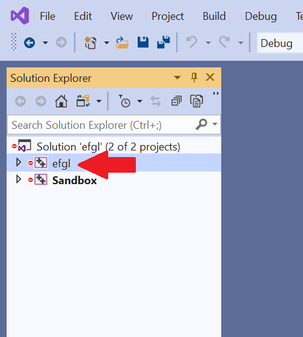

# efgl
## About
Currently, this is just a C++ abstraction of the OpenGL API (I plan to expand to other rendering APIs at some point, such as Vulkan). It will be useful for me to have this around for various projects I might want to do in the future.
### Long-term Goals
Once I finish building the basic abstractions, such as `VertexBuffer`, `IndexBuffer` and other OpenGL object types, I will begin following the tutorial [here](https://learnopengl.com/Model-Loading/Assimp) to learn about making meshes, materials, and other things of that level of abstraction. This will allow me to experiment with Vulkan and possibly other APIs. Along with that, I will develop this library by learning about cool rendering techniques, which I will figure out how to add to this project.
## Getting Started
### Requirements
* [Microsoft Visual Studio 2019](https://visualstudio.microsoft.com/vs/), although I plan to make this cross-platform eventually    
### Installation
Open a command prompt in the directory where you cloned this repo. Type the command `cd setup/`, followed by `./setup.exe`. In the `efgl/` directory, there should now be a file named `efgl.sln`.   
### Building `efgl` as a static library
First, open `efgl/efgl.sln` in Visual Studio. Click on the `efgl` __project__ (not solution) in the solution explorer on the left.      
   
      
    
Press <kbd>⌘B</kbd> to build the selected project. Now, in the main `eflg/` directory, your .lib file should be in a directory named something like `eflg/Debug-windows-x86_64/`.  
### Using the `efgl` Sandbox
First, open `efgl/efgl.sln` in Visual Studio. Then, you can simply use the Sandbox project as you would any other project as it comes with the linking and include directories already set up. Add your source files in `/efgl/efgl/Sandbox/src`, which will come with a simple `main.cpp` already there.      
### Using `efgl` in another project
For this, you will need to follow the steps in the section titled "Building `efgl` as a static library." Once you have the .lib file, add it as a dependency to your project. For the headers, I recommend creating a `efgl/` directory in your include directory and pasting the contents of `efgl/efgl/efgl/include` into that folder.
## Acknowledgements
* Thank you to [The Cherno](https://github.com/TheCherno) for his awesome Youtube series that got me into OpenGL, which can be found [here](https://www.youtube.com/watch?v=W3gAzLwfIP0&list=PLlrATfBNZ98foTJPJ_Ev03o2oq3-GGOS2). I am following his videos to abstract OpenGL, the first of which can be found [here](https://www.youtube.com/watch?v=bTHqmzjm2UI&list=PLlrATfBNZ98foTJPJ_Ev03o2oq3-GGOS2&index=13). He also came up with the "skeleton" of the `premake5.lua` script.
* I'm going to start following a tutorial on 
* This project currently relies on [GLFW](https://www.glfw.org/), which is an open-source library for OpenGL.    
* This project also relies on [glad](https://github.com/Dav1dde/glad), which is a OpenGL Loader-Generator.
