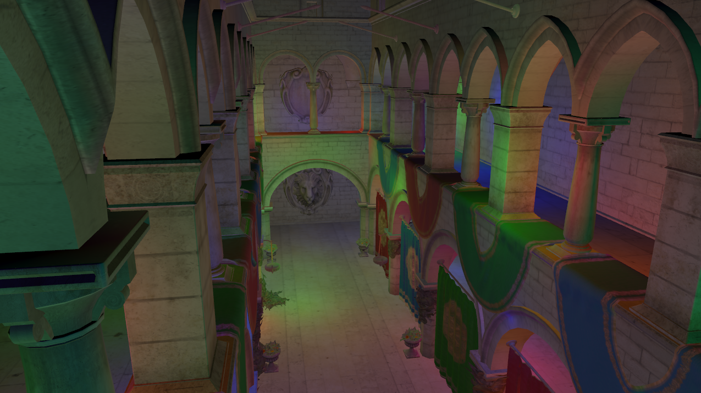
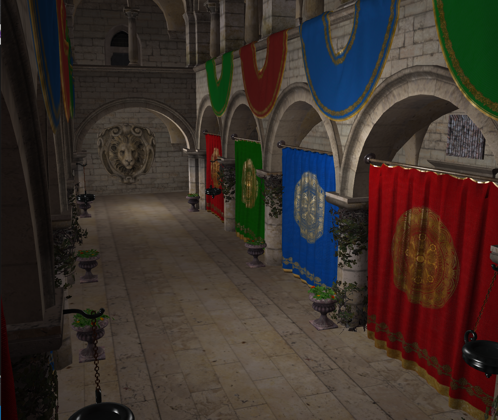
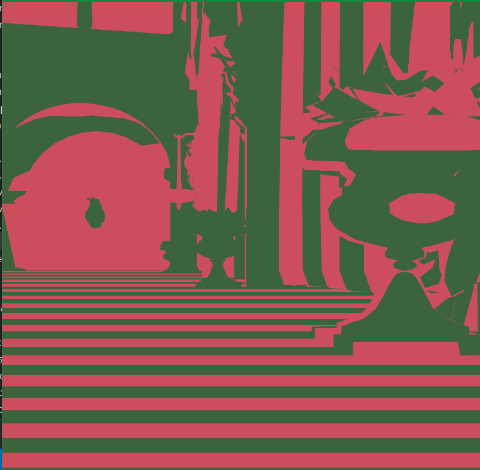
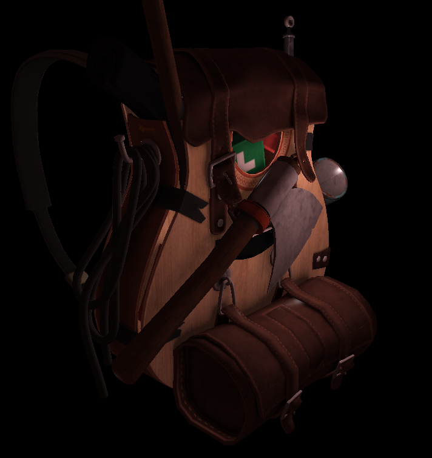
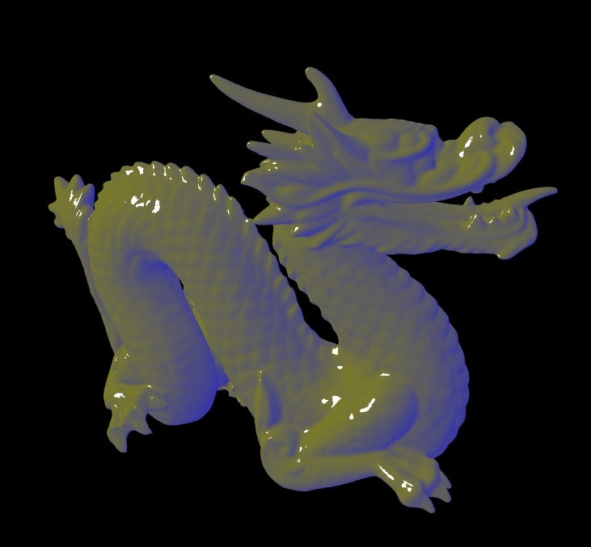

# efgl

## About
This engine is somewhere I can implement modern rendering techniques and hopefully make some beautiful images along the way. So far, this engine has successfully implemented the following features:

* Clustered forward shading model using OpenGL compute shaders
* Physically based shading model
* Linear lighting
* HDR with Reinhard tonemapping
* Gamma-correction

The current roadmap is as follows:

* Shadows using NVidia's PCSS algorithm, which builds off the classic shadowmapping technique and cleanly replcaces the PCF step.
* Post-processing, including SSAO. 
* SSS. I mean how hard could it be?

### Progress So Far

Sphere primitive generated.

Clustered forward shading result with 1024 lights on the Sponza scene. This is using a Blinn-Phong lighting model and HDR + Reinhard tonemapping, along with gamma correction.

Simple phong lighting model with forward rendering, which will be adapted to work with clustered forward rendering.

Debug screenshot of subdividing between near and far plane into clusters on the sponza model. This idea will be used in the compute shader for culling lights into clusters. 

   

First rendered model.  

Gooch shading model implementation. See reference for Stanford dragon model below.

Morgan McGuire, Computer Graphics Archive, July 2017 (https://casual-effects.com/data)

## Getting Started
### Requirements
* [Microsoft Visual Studio 2019](https://visualstudio.microsoft.com/vs/), although I plan to make this cross-platform eventually. I've never tested on other platforms so I can't say what would happen exactly.
### Installation
Open a command prompt in the directory where want to clone the repo. Enter `git clone --recursive https://github.com/deadbird11/efgl.git`, then `cd efgl`. Type the command `cd setup/`, followed by `./setup.exe`. In the `efgl/` directory, there should now be a file named `efgl.sln`. I haven't tried this for other platforms, and, while it ought to produce a proper project file for whatever IDE you use due to premake, I doubt the code is as platform agnostic.

## Acknowledgements
* Thank you to [The Cherno](https://github.com/TheCherno) for his awesome Youtube series that got me into OpenGL, which can be found [here](https://www.youtube.com/watch?v=W3gAzLwfIP0&list=PLlrATfBNZ98foTJPJ_Ev03o2oq3-GGOS2). He also provided the `premake5.lua` script, although it has been changed rather extensively over the ages.
* This project currently relies on [GLFW](https://www.glfw.org/), which is an open-source library for OpenGL.    
* This project also relies on [glad](https://github.com/Dav1dde/glad), which is a OpenGL Loader-Generator.
* I am using [ASSIMP](https://www.assimp.org/) as my model loading library.
* This project uses [tracy](https://github.com/wolfpld/tracy) for profiling, which is a *seriously* cool tool.
